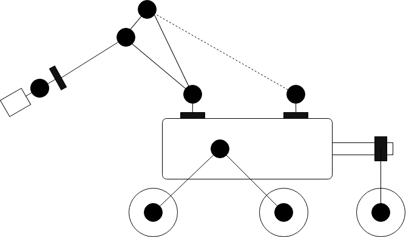
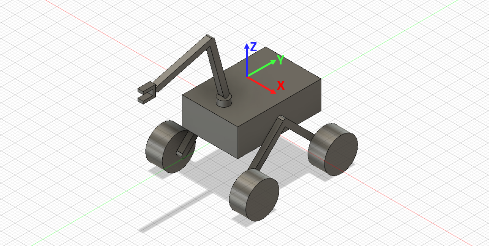

# Template

> *Quoted text (like this one) is indicative of instructions.*
>
> These have to be removed from the final draft

> ## File Management
>
> The entire archival project will be synced to the **GitHub** repository:
>
> [`https://github.com/Team-Anveshak/Design-Archival.git`](https://github.com/Team-Anveshak/Design-Archival.git)
>
> - All image resources must be stored in the `20XX/img/` folder
> - 3D Models must be saved in the `20XX/3d/` folder
> - The markdown file (`20XX.md`) and the corresponding pdf file (`20XX.pdf`) must be directly kept in the `20XX/` directory.

## Picture

```
Resolution: 1920 x 1080

```

## Model Schematic

> A model schematic as shown below must be attached. (No naming needed)
>
> The following sample schematic of 2017 rover can be used as a base reference:
>
> [`https://drive.google.com/file/d/1oZZ8szdasjbt7QmjQrkl4KEyCJDj0sA8/view?usp=sharing`](https://drive.google.com/file/d/1oZZ8szdasjbt7QmjQrkl4KEyCJDj0sA8/view?usp=sharing)



> Note: the above abstraction of the design ignores the following two features:
>
> - Actuation - The actuators are either embedded in the joints (motors) or along the links (linear actuator). They are not represented in the schematic.
> - Transmissions - These are not depicted as they do not add any functional representation

> **The schematic stands as a reference for segregation of sub-assemblies.** 

> ## Model Detailing
>
> #### Axis Orientation
>
> > The axis orientation in Fusion 360 must be set as "**Z axis UP**"
>
> 
>
> #### Grouping and Nomenclature
>
> *Having prepared the schematic, the assembly can be represented as*:
>
> The final assembly shall be a assembly of non-moving components attached by joints. This also means that all the joints must be defined in the final assembly and **not** inside sub-assemblies. 
>
> ##### 1. Linkages
>
> All the non-moving parts in a group shall be combinedly termed as a linkage. The linkage, therefore, can be a sub-assembly by itself. 
>
> Label - $$L_n$$ - **L_n**
>
> (n is any number)
>
> ##### 2. Joints
>
> All the linkages are joined to each other (either in serial chain or parallel) via joints
>
> Label - **$$J_{xy}$$** - **J_x_y**
>
> ($$x$$ and $$y$$ are the the linkages that are joined by the joint $$J$$) 
>
> > Wheels, Gripper and Digger denote the ends of these chains

## Model Export

> Following files have to be exported:
>
> - STEP (v2017.step)
> - F3Z (v2017.f3z)

